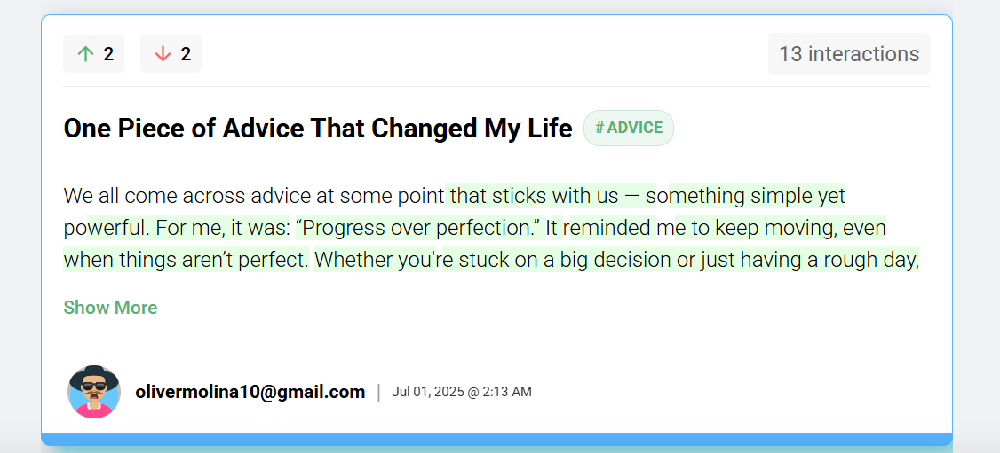
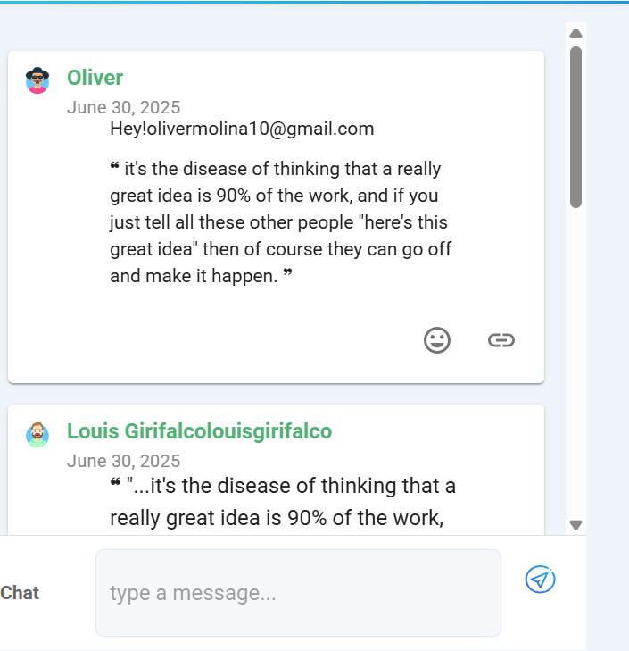

# Welcome to Quote.Vote

Quote.Vote is a text-first civic engagement platform designed for thoughtful public dialogue. It’s a space where people can post, vote, and discuss written content focusing on ideas instead of algorithms or ads.

### Core Principles

- **Text-First:** Quote.Vote emphasizes words over visuals. Every conversation starts from written ideas, not photos or memes.
- **Public-by-Default:** All posts and discussions are open and visible to everyone. This promotes transparency and shared understanding.
- **Respectful Participation:** Engage with curiosity and empathy. Listen, read carefully, and respond thoughtfully.
- **Reflection Over Reaction:** Take a moment to understand before responding. The platform encourages meaningful dialogue instead of quick takes.

 **Tip:** Quote.Vote is designed for reflection, not argument. The more you engage with respect and clarity, the better the discussions become.

## Voting on Text

Voting lets you express agreement or disagreement with specific parts of a post — not just the post as a whole. This helps surface the most valuable insights and keeps discussions focused on ideas.

### How to Vote

1. Open any post.
2. Hover over or tap on the text you’d like to respond to.
3. Small **upvote (👍)** and **downvote (👎)** icons will appear next to the text.
4. Click **Upvote** to show agreement or appreciation, or **Downvote** to signal disagreement or concern.
5. Your vote is recorded instantly, and you can change it anytime.

   

### What Your Vote Means

- **Upvote (👍)** → You agree, support, or find the text valuable.  
- **Downvote (👎)** → You disagree, or think it’s inaccurate or unhelpful.  

## Transparency ##

Votes are public by default anyone can see how each passage is rated. This encourages honesty, reflection, and accountability in public dialogue.

_Alt-text:_ “Vote buttons appear beside each text passage to allow targeted feedback.”

** Quoting & Highlighting **

On Quote.Vote, you can pull out powerful lines or thoughts from any post by highlighting text and turning it into a quote.

How to create a quote:

- Select any text you find meaningful or worth discussing.

- A small popup menu will appear - click “Quote”.

- Add an optional attribution or citation URL (e.g., the source of the text).

- If you used an AI tool to assist your post, check the “AI-generated” indicator box for transparency.

- Hit Post Quote — your quote will appear in its own discussion thread (a quote room).

Tips:

- Quoting is public by default others can join your quote’s thread and respond.

- Keep quotes short and focused (one key idea per quote).

- Avoid editing quotes to change meaning — only quote what’s actually written.

Example:

“Reflection is more powerful than reaction.”
— Highlighted from a user post, now open for discussion.

Screenshot placeholder:
 

## Participating in Threads

Threads are where the discussion happens — you can comment on posts, reply to quotes, and engage with other users.

### How to Participate

1. Scroll to the bottom of any post or quote.  
2. Type your comment in the comment box.  
3. To reference a quote, click the **quote icon** inside the comment box.  
4. Press **Post** to share your comment with everyone.

### Tips for Engaging

- Be respectful and stay on topic.  
- Reply thoughtfully instead of reacting impulsively.  
- Rate limits: You can post once every 15 seconds to prevent spam.  
- Remember: all comments are public by default.

_Alt-text:_ “Commenting on a post with a quote reference in Quote.Vote.”

## Rooms & Buddy List ## 

On Quote.Vote, you can join **discussion rooms** tied to specific posts or chat privately with friends (your buddies).  

**How to use rooms:**  
1. Open a post you want to discuss.  
2. Click **“Join Room”** — now you’re in a live chat for that post.  
3. Type messages and reply to other users.  

**Buddy list:**  
- Add someone as a **buddy** by clicking their profile → **Add Buddy**.  
- Only mutual buddies can chat privately.  
- Presence indicators show who’s online.  

**Tips:**  
- Rooms are post-specific, so discussions stay focused.  
- Keep private chats respectful and friendly.  

📸 *Screenshot idea:* Show the rooms list and buddy list with online/offline indicators.  
_Alt-text:_ “List of rooms for posts and buddies with online status indicators.”

## Search & Discovery ##

Finding posts, topics, or people on Quote.Vote is easy. You can search by keywords, hashtags, or users and quickly join conversations that interest you.

**How to search:**  
1. Click the **Search** bar at the top of the page.  
2. Type a keyword, hashtag, or username.  
3. Press **Enter** — results will show posts, quotes, and users matching your search.  
4. Click any result to open the post or user profile.  

**Tips:**  
- Hashtags help you follow topics you care about.  
- Search results are paginated — scroll down to see more.  
- You can copy the URL of any post or quote to **share it with others**.  

📸 *Screenshot idea:* Show the search bar with a keyword typed in and results below.  
_Alt-text:_ “Search bar with example results for posts, quotes, and users.”

## Safety & Moderation ##

Your safety and a positive community experience are important on Quote.Vote. You can report posts, block users, and see moderation notes to stay informed.

**How to stay safe:**  
1. To **report a post or comment**, click the three-dot menu (⋮) next to it and select **Report**.  
2. To **block a user**, go to their profile and click **Block** — you won’t see their posts or comments anymore.  
3. Moderators may leave **transparent notes** on actions taken. You can view these to understand why content was removed or flagged.  

**Tips:**  
- Use the reporting feature responsibly — only flag content that violates community guidelines.  
- Remember: moderation is **public and transparent** to keep the community accountable.  
- Respect everyone, even if you disagree — keep discussions constructive.  

📸 *Screenshot idea:* Show the report menu and block button on a post.  
_Alt-text:_ “Reporting a post and blocking a user in Quote.Vote.”

## Settings ##

Customize Quote.Vote to match your preferences. You can change themes, notifications, and accessibility options to make the platform comfortable for you.

**How to access settings:**  
1. Click your **profile icon** at the top-right corner.  
2. Select **Settings** from the dropdown menu.  

**What you can do in Settings:**  
- **Themes:** Switch between Light and Dark modes.  
- **Notifications:** Choose which notifications you want to receive (e.g., votes, comments, mentions).  
- **Accessibility:** Adjust contrast, font size, and enable screen reader support.  

**Tips:**  
- Dark mode helps reduce eye strain at night.  
- Turn off notifications if you want focused reading time.  
- Accessibility settings make the platform usable for everyone.  

📸 *Screenshot idea:* Show the settings page with theme toggle and accessibility options.  
_Alt-text:_ “Settings page showing theme switch, notifications, and accessibility options.”

## FAQ / Troubleshooting ##

Sometimes things don’t go as expected. Here are quick tips to help new users troubleshoot common issues.

**Common Questions:**  

1. **Password Reset**  
   - Click **Forgot Password** on the login page.  
   - Follow the email instructions to reset your password.

2. **Inviting Friends**  
   - Go to a post or quote you want to share.  
   - Click **Share** and copy the link or send it via email.

3. **Email Delivery Issues**  
   - Check your spam folder.  
   - Make sure your email is verified in Settings.

4. **Mobile Quirks**  
   - If buttons don’t respond, refresh your browser or restart the app.  
   - For small screens, scroll horizontally to see full content or reactions.

**Tips:**  
- Most issues can be solved by refreshing the page or checking Settings.  
- Reach out to support only if the problem persists.  

📸 *Screenshot idea:* Show login page with “Forgot Password” link and share menu.  
_Alt-text:_ “Login page showing password reset link and sharing options.”

